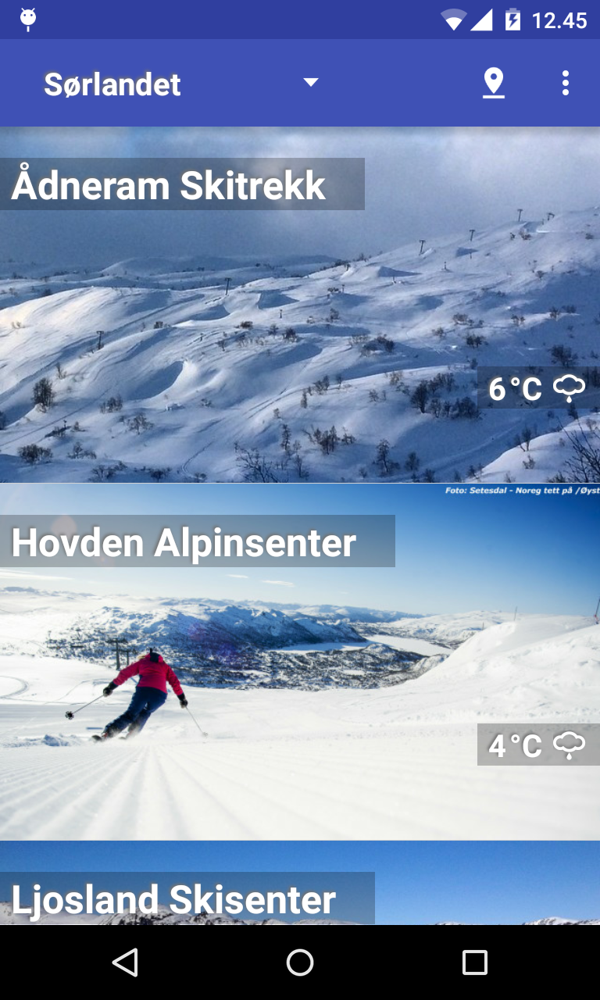
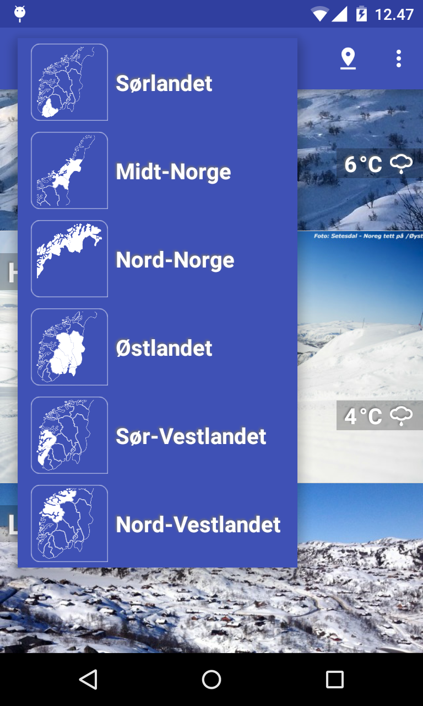
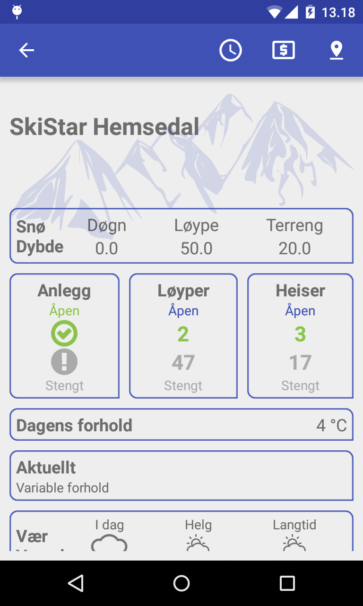
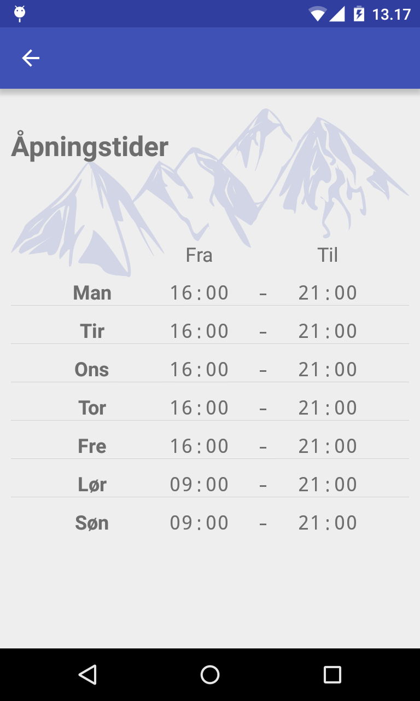
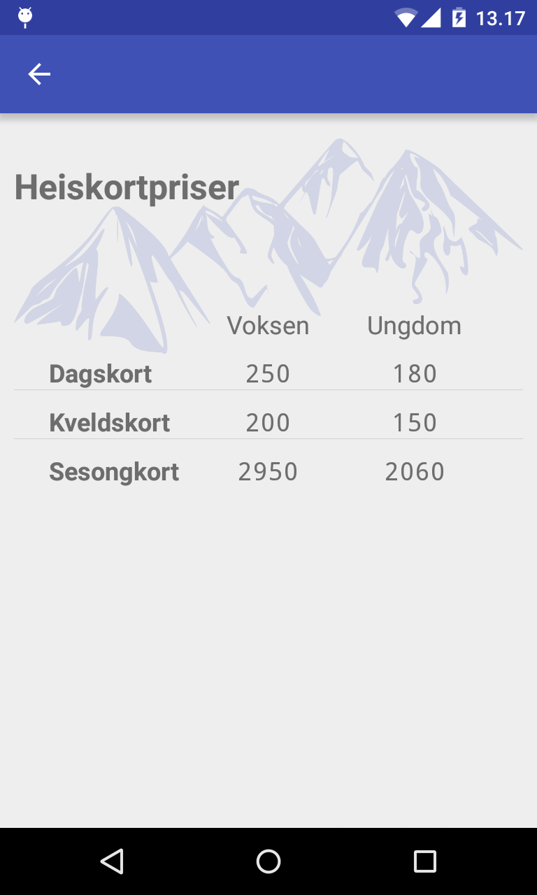
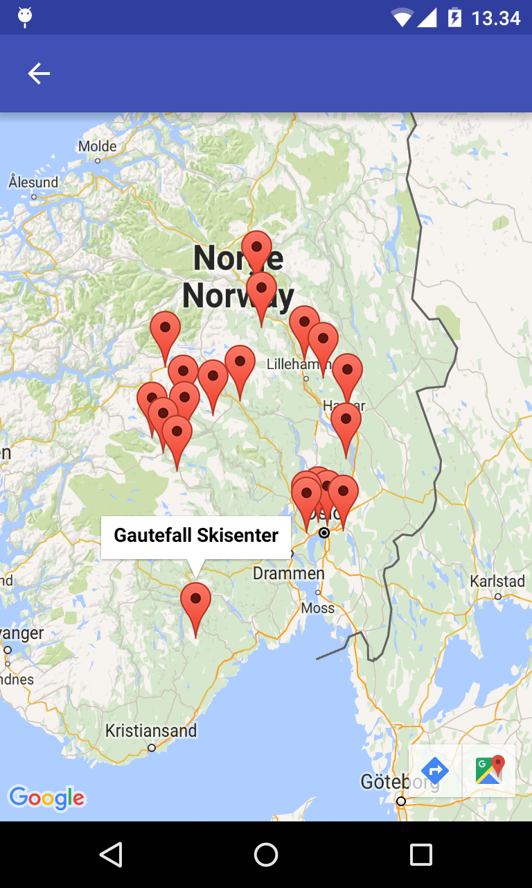

# alpineinfo-app (student project)

A depriciated application that leverages the Fnugg API to fetch and display the most recent slope conditions and statuses for ski resorts across Norway. It provides users with up-to-date information on snow conditions, weather forecasts, and other relevant details to help them plan their skiing trips more effectively.

## Screenshots

